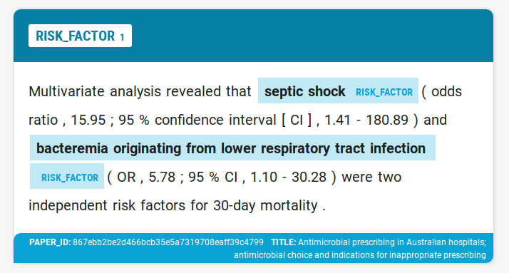

# COVID-19 Open Research Dataset Challenge (CORD-19)

Kaggle challenge: [CORD-19](https://www.kaggle.com/allen-institute-for-ai/CORD-19-research-challenge)

Task: [What do we know about COVID-19 risk
factors?](https://www.kaggle.com/allen-institute-for-ai/CORD-19-research-challenge/tasks?taskId=558)

## Team

- Adrianna Safaryn
- Anna Haratym-Rojek
- Cezary Szulc
- Marek Grzenkowicz

## Goal

We wanted to use named entity recognition (NER) to highlight names of risk factors (RF). Our goal was
training a **custom NER model for spaCy**, that could later be use to recognize risk factors in medical
publications.



## Pipeline

1. Data preprocessing to extract 'risk factor(s)' sentences
2. Manual data annotation in Prodigy
3. Pretraining different models - we experimented with different base models and trained a number of
   *tok2vec* layers to maximize the F-score
    - base models: `en_vectors_web_lg`, `en_core_web_lg`, `en_core_sci_lg`
    - *tok2vec* layers were trained for: RF sentences, subset of abstracts, all abstracts
4. Labelling more data by correcting the predictions of the top model trained in the previous step
5. Go back to step #3 to pretrain a new model using more data and then label even more data
6. Training the final model with all gathered annotations

## Model performance

Each iteration uses all datasets from the previous one and adds more annotations. For detailed information about every
trained model, see the notebook [train_experiments_2.ipynb](./train_experiments_2.ipynb).

### Base model `en_core_sci_lg`

| Iteration  | Datasets ([data/annotated/](./data/annotated/)) | Best F-score  |
|------------|-------------------------------------------------|---------------|
| 1          | `cord_19_rf_sentences`                          |   53.333      |
| 2          | above + `cord_19_rf_sentences_correct`          | **75.630**    |
| 3          | above + `cord_19_rf_sentences_correct_2`        |   74.894      |
| 4          | above + `cord_19_rf_sentences_correct_3`        |   68.770      |

### Base model `en_core_sci_md`

| Iteration  | Datasets ([data/annotated/](./data/annotated/)) | Best F-score  | Download |
|------------|-------------------------------------------------|---------------|------------------------------------------------------------------------------------------------------------|
| 1          | `cord_19_rf_sentences`                          |   57.778      | [en_ner_rf_i1_md](https://kagglecord19.blob.core.windows.net/risk-factor-ner/en_ner_rf_i1_md-0.0.1.tar.gz) |
| 2          | above + `cord_19_rf_sentences_correct`          | **74.380**    | [en_ner_rf_i2_md](https://kagglecord19.blob.core.windows.net/risk-factor-ner/en_ner_rf_i2_md-0.0.1.tar.gz) |
| 3          | above + `cord_19_rf_sentences_correct_2`        |   74.236      | [en_ner_rf_i3_md](https://kagglecord19.blob.core.windows.net/risk-factor-ner/en_ner_rf_i3_md-0.0.1.tar.gz) |
| 4          | above + `cord_19_rf_sentences_correct_3`        |   69.725      | [en_ner_rf_i4_md](https://kagglecord19.blob.core.windows.net/risk-factor-ner/en_ner_rf_i4_md-0.0.1.tar.gz) |

Using a smaller base model (`md` instead of `lg`) results in significantly smaller model, while the F-score
moves in both directions depending on the iteration.

## Packaged models

--------------

**WARNING!**

The packaging must be fixed, because `spacy.load("en_ner_rf_i1_md")` is failing:

> OSError: [E050] Can't find model 'en_core_sci_md_vectors'. It doesn't seem to be a shortcut link, a Python package or a valid path to a data directory.

--------------

Medium models for iterations 1-4 can be installed using the download links from the table above.

The directory [test/](./test/) contain a notebook showing the models in action.

## Key files and resources

- Data preprocessing: [Kaggle notebook](https://www.kaggle.com/cezaryszulc/kaggle-covid-19-competition)
- Training of *tok2vec* layers: [Kaggle notebook](https://www.kaggle.com/chopeen/spacy-with-gpu-support)
- Full set of annotations:
  - [cord_19_rf_sentences_merged.jsonl](./data/annotated/cord_19_rf_sentences_merged.jsonl) (dump of the Prodigy dataset)
  - [cord_19_rf_sentences_merged.json](./data/annotated/cord_19_rf_sentences_merged.json) (spaCy JSON format)
- Log of all experiments (including data annotation and model training): [train_experiments_2.ipynb](./train_experiments_2.ipynb)
- Early experiments: [train_experiments_1.ipynb](./backup/early_experiments/train_experiments_1.ipynb)

## Challenges

- Detailed discussion posted at the Kaggle forum:
  [Custom NER model to recognize risk factor names](https://www.kaggle.com/allen-institute-for-ai/CORD-19-research-challenge/discussion/140451)
- Question posted to the Prodigy support forum:
  [Annotating compound entity phrases](https://support.prodi.gy/t/annotating-compound-entity-phrases/2796)

## Data preprocessing

```txt
+------------------+           +------------------+           +------------------+
|                  |           |                  |           |                  |          +----------------------------+
|                  |  FILTER   | Abstracts and    |  FILTER   | Sentences that   |          |                            |
| CORD-19 dataset  +---------->| articles that    +---------->| contain phrase   +--------> | cord_19_rf_sentences.jsonl |
|                  |           | mention COVID-19 |           | "risk factor(s)  |          |                            |
|                  |           | and synonyms     |           |                  |          +----------------------------+
+------------------+           +------------------+           +------------------+
```

## Tools

- [Prodigy](https://prodi.gy/) - text annotation
- [spaCy](https://spacy.io/) - NLP and model training
- [scispaCy](https://allenai.github.io/scispacy/) - specialized spaCy models for biomedical text processing
- [Miniconda](https://docs.conda.io/en/latest/miniconda.html) - environment setup (you can use
  `conda env create -f environment.yml` to set up the Python environment with all packages and models)

## Dataset citation

COVID-19 Open Research Dataset (CORD-19). 2020. Version 2020-03-13.  
Retrieved from https://pages.semanticscholar.org/coronavirus-research.  
Accessed 2020-03-26. doi:10.5281/zenodo.3715506

## Notes

1. [When to reject when annotating text for NER?](https://support.prodi.gy/t/when-to-reject-in-ner-manual-or-ner-make-gold/892/2)
1. [When should I press accept, reject or ignore?](https://prodi.gy/docs/named-entity-recognition#manual-accept-reject)
1. [`batch-train` is deprecated](https://prodi.gy/docs/recipes#deprecated)
